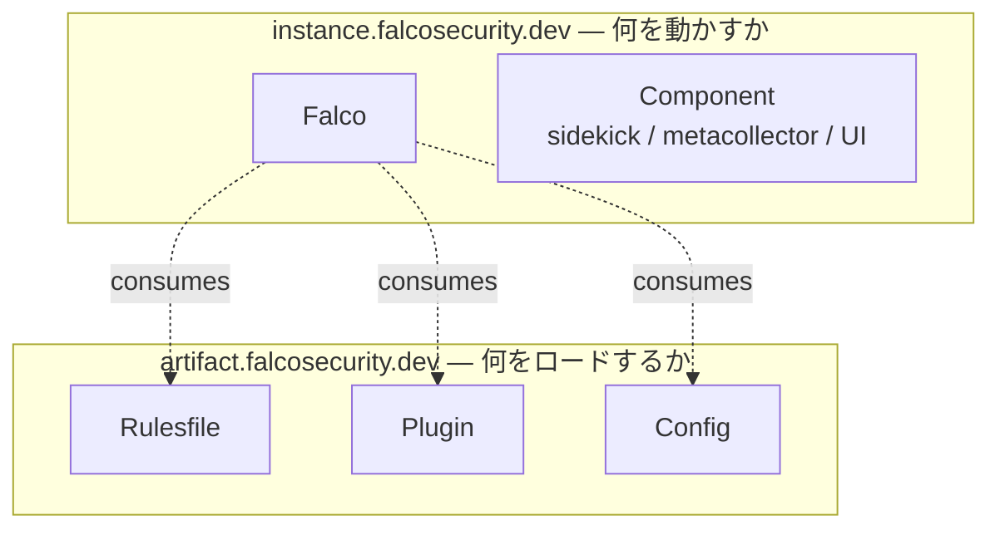
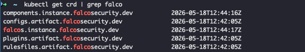
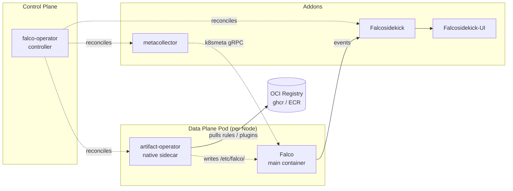
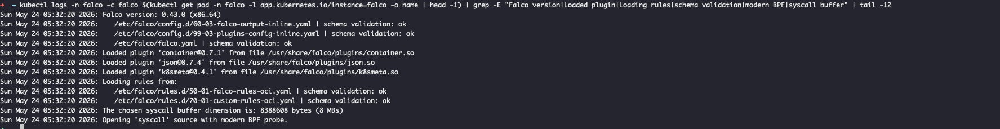
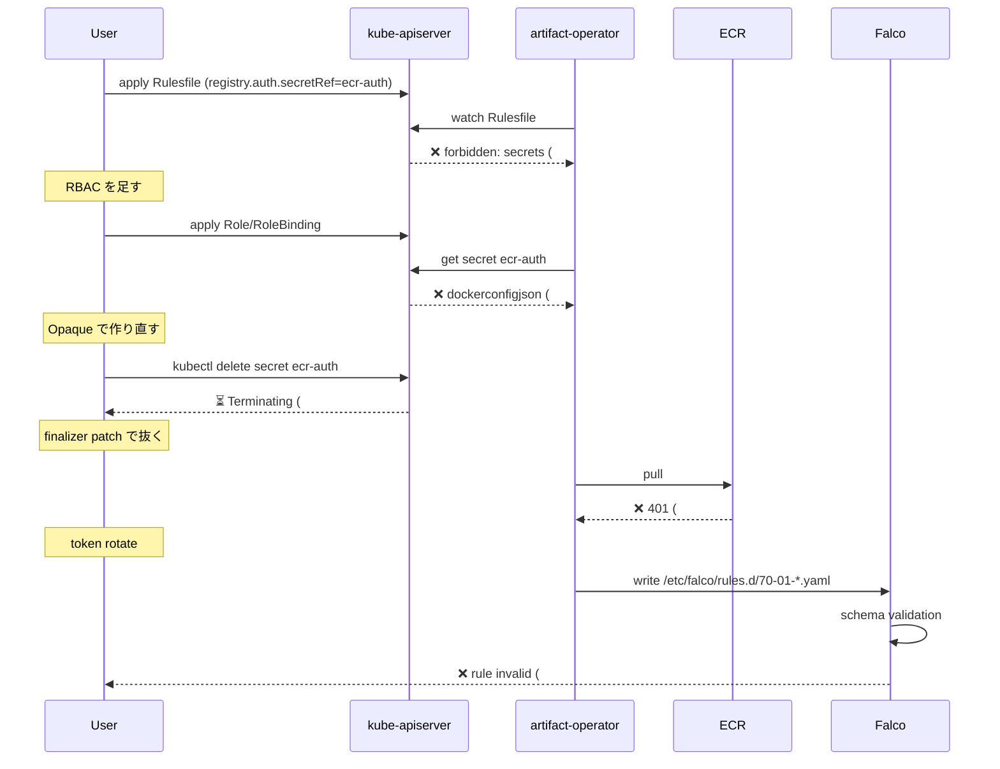
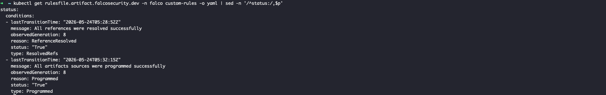
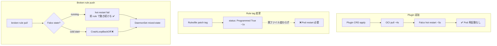

CNCF Graduated の [Falco](https://falco.org/) は長らく Helm で配布されてきましたが、2026-03-23 リリースの **Falco Operator v0.2.0** が「最初の production-ready 版」を名乗っています。実際に EKS で 10 シナリオ・3 日間ほど触り倒したところ、**17 個の非自明なハマりどころ**が見つかりました。本記事はその検証ログを 3 章に整理した、運用観点のレビューです。

検証コード・マニフェストは [higakikeita/falco-operator-v020-validation](https://github.com/higakikeita/falco-operator-v020-validation) に置いてあります。

> 環境：EKS 1.31.14 (ap-northeast-1, t3.large × 2) / Falco 0.43.0 / Falco Operator 0.2.0 / modern eBPF probe

---

## 1. v0.2.0 は何を変えたのか — Operator パターンと Runtime Security as Code

### 1.1 そもそも Falco を Kubernetes 上で運用すると何が面倒か

Falco は syscall / eBPF / Kubernetes Audit を見て runtime threat を検知するエンジンです。Helm で入れること自体は簡単ですが、本番運用すると以下が一斉に必要になります。

- **Rules**：YAML を ConfigMap に置く運用、誰が更新するかでもめる
- **Plugins**：`.so` バイナリの配布、バージョン揃え
- **Config fragment**：output 設定の追記がコピペになる
- **Falcosidekick**：alert 転送の責務分離、別 Chart で別管理
- **Multi-tenant**：namespace ごとに違う rule を入れたいが Helm では難しい
- **Lifecycle**：rule だけ動的に更新したい、Falco は止めたくない

v0.2.0 はこの全部を **Kubernetes の CRD と Operator パターン**で吸収します。

### 1.2 v0.2.0 の核心：CRD を 2 つの API グループに分けた

これが v0.2.0 設計思想の中心です。



- **instance グループ**：DaemonSet や Deployment を作る「実行体」の CRD
- **artifact グループ**：OCI Registry からロードする「コンテンツ」の CRD

この分離が効くのは「rule を image と同じパイプラインで運べる」ことです。`ghcr.io/your-org/falco-rules:v1.2.3` を push して Rulesfile CRD で参照すれば、それだけで全 Pod に配布される。**Runtime Security as Code** のための前提が CRD レベルで作り込まれています。



### 1.3 全体アーキ — Operator + artifact-operator + metacollector



注目すべき 3 点：

1. **artifact-operator が各 Falco Pod の native sidecar として動く**。OCI registry から rule/plugin を pull して `/etc/falco/` 配下に書き込む役割。
2. **metacollector** は単独 Deployment として動き、Kubernetes API をウォッチして pod/namespace/labels を集約し、各 Falco の `k8smeta` plugin に gRPC で配信。
3. Operator 本体は **どの Pod も作らない**。CRD を見て artifact-operator や Component に reconcile を委譲する薄いコントローラーです。

### 1.4 native sidecar (K8s 1.29+)

artifact-operator は **`initContainer` として宣言され、`restartPolicy: Always` を持つ**。これが Kubernetes 1.29 から beta 入りした「native sidecar container」の正体です。

```yaml
initContainers:
- name: artifact-operator
  image: docker.io/falcosecurity/artifact-operator:0.2.0
  restartPolicy: Always  # ← これが付くと sidecar として振る舞う
```

「Pod の lifecycle と一蓮托生だが、Falco container より先に Ready になる」という挙動が標準化されたおかげで、Falco は起動時点で必ず rules が `/etc/falco/rules.d/` に置かれている状態になります。**Kubernetes 1.29+ が必須**なのはこのため。

---

## 2. Quickstart から ECR 配布まで — 触って分かった 9 つの落とし穴

公式 README どおりに `kubectl apply -f quickstart.yaml` すると、まずここで止まります。

### 2.1 install.yaml が `kubectl apply` で死ぬ（Finding #1）

```
The CustomResourceDefinition "components.instance.falcosecurity.dev" is invalid:
metadata.annotations: Too long: must have at most 262144 bytes
```

`kubectl apply` は `last-applied-configuration` annotation に YAML 全文を書き込むため、CRD が大きいと 262 KB 制限に引っかかります。これは v0.2.0 の CRD が schema を細かく書いた結果として大きくなったため。

**回避**：`--server-side` を使う。

```bash
kubectl apply --server-side --force-conflicts \
  -f https://github.com/falcosecurity/falco-operator/releases/download/v0.2.0/install.yaml
```

### 2.2 EKS 1.31 では Redis が永遠に Pending（Finding #2）

Quickstart は falcosidekick-ui 用に Redis StatefulSet を立てます。が、EKS 1.31 は **in-tree EBS provisioner (`kubernetes.io/aws-ebs`) が削除済み**。デフォルトの `gp2` StorageClass はあるけど、provisioner が動かないので PVC が unbound のまま。

**回避**：`aws-ebs-csi-driver` addon + `gp3` StorageClass を default 化（[infra/gp3-storageclass.yaml](../infra/gp3-storageclass.yaml)）。

### 2.3 動いた — Falco DaemonSet が `2/2` になる

ここまでクリアすると Falco pod が `2/2 Running` になります。コンテナの内訳が v0.2.0 の見どころ：

```bash
$ kubectl get pod -n falco -l app.kubernetes.io/instance=falco \
    -o jsonpath='{.items[0].spec.initContainers[0]}'
# {"name":"artifact-operator","restartPolicy":"Always",...}
```

initContainer なのに restartPolicy が Always — これが native sidecar の正体です。



### 2.4 enrichment が 2 経路ある（Finding #6）

Detection を 1 つ撃ってみます。

```bash
$ kubectl exec -n test nginx -- cat /etc/shadow
```

すると `Read sensitive file untrusted` (Warning) が発火し、payload にこんな field が並びます。

```json
{
  "k8s.ns.name": "test",
  "k8s.pod.name": "nginx",
  "k8smeta.ns.name": "test",
  "k8smeta.pod.name": "nginx"
}
```

`k8s.*` は Falco の container introspection から、`k8smeta.*` は **metacollector → k8smeta plugin** 経由。**同じ意味の field が独立した経路で来ている**のは設計上意図的です。新規 Pod に対して片方が race condition で欠落したとき、もう片方が拾える冗長性を担保しています。

実測：scale 0 → 30 でデプロイ直後（pod Ready から ~3 秒）に exec しても、両方とも埋まっていました。


### 2.6 蛇足：Slack 連携は enterprise だと止まる（Finding #17）

`WEBHOOK_ADDRESS` 環境変数を Component CRD で注入すれば webhook.site などへの forward は即動きます。が、**`SLACK_WEBHOOKURL` を取得しに行くと**、enterprise Slack workspace（Sysdig 含む）では `Incoming Webhooks` の app install に **admin 承認が必要**で、開発者が手元で完結できません。

検証のサクサク感とは別問題ですが、本番投入時の「Falcosidekick の output 設定をセットアップする責任者は誰か」を最初に決めておかないと、Runtime Security の通知だけ宙ぶらりんになります。回避策は個人 workspace で webhook を作って検証→本番は admin 経由で発行、または Slack を経由せず PagerDuty / Email / Webhook → 別 hub（Datadog 等）に流す方針に切り替え。

### 2.5 自作 rule を ECR に置きたい — ここから 7 連発

「rule を OCI artifact として配布する」が v0.2.0 の本丸機能なので、自作 rule を ECR に push して Rulesfile CRD で参照する流れを試したところ、**7 個ハマりました**。



並べ直すとこうです：

| # | 何が起きるか | 対応 |
|---|---|---|
| #7 | `falco` SA に secrets RBAC なし | Role/RoleBinding 追加（[rbac-falco-secrets.yaml](../manifests/rbac-falco-secrets.yaml)） |
| #8 | Secret は **Opaque + username/password**、dockerconfigjson は NG | `kubectl create secret generic` で作る |
| #9 | artifact-operator が `secret-in-use` finalizer を貼る → delete が hang | `kubectl patch ... -p '{"metadata":{"finalizers":[]}}'` |
| #10 | ECR token は **12h で expire**、in-cluster Secret も腐る | CronJob で rotate、IRSA + ECR helper |
| #11 | `spawned_process` / `container` macro が default OCI rule に**含まれていない** | inline で `evt.type=execve and container.id != host` を書く |
| #12 | `oras push` の tar.gz は Falco が parse 不可 → schema validation: none | **`falcoctl push` 必須**（追加メタレイヤーを生成） |

最終的に動かすと、Rulesfile の status がこうなります。

```yaml
status:
  conditions:
  - type: ResolvedRefs
    status: "True"
  - type: Programmed
    status: "True"
    message: All artifacts sources were programmed successfully
```



---

## 3. Runtime Detection Lifecycle の本丸 — Hot Reload / Rollback / Upgrade の真実

ここからが運用判断に直結する話です。**「rule を image のように扱える」が宣伝文句通りなのか**、検証しました。

### 3.1 Plugin の hot reload は綺麗に動く ✅

`json` plugin を Plugin CRD で追加してみます。

```bash
$ date -u +%FT%TZ; kubectl apply -f manifests/plugin-json.yaml
2026-05-22T10:18:21Z
plugin.artifact.falcosecurity.dev/json serverside-applied
```

- **T+4s**：Plugin CRD が `Programmed: True`
- **T+5s**：Falco が hot restart して `Loaded plugin 'json@0.7.4'`
- **Pod 再起動は発生せず** (RESTARTS counter は変化なし)
- 検知 downtime は視認不可

Falco の内部 hot restart は `Falco initialized` のログをもう一度吐いて完了します。**SIGHUP 相当の reload が、コンテナ runtime からは観測されないレベルで完結する**のがポイント。

### 3.2 しかし Rule の hot reload は壊れている ❌（Finding #13）

同じノリで、Rulesfile の OCI tag だけ差し替えてみます。

```bash
$ kubectl patch rulesfile.artifact.falcosecurity.dev -n falco custom-rules \
    --type=merge -p '{"spec":{"ociArtifact":{"image":{"tag":"custom-v5"}}}}'
```

**1 秒後**、CRD status は `Programmed: True` に変わる。`message` は `All artifacts sources were programmed successfully`。

ところが**実ファイルは変わっていない**。

```bash
$ kubectl exec falco-... -- grep '^- rule:' /etc/falco/rules.d/70-01-custom-rules-oci.yaml
- rule: Reverse shell via netcat -e       # ← v3 (古い)
- rule: Curl pipeline to shell             # ← v3 (古い)
# v5 で追加したはずの 'Hot reload sentinel' が居ない
```

artifact-operator のログを見ても、**tag を変えただけでは re-pull していない**。annotation で reconcile を強制しても同じ。

唯一動く方法は **Pod を delete して再起動**。fresh start で artifact-operator が新タグを pull します。ただしこの場合、**Falco DaemonSet 全 Pod が一斉に消えてから 45 秒ほど検知が空白**になります。

これは v0.2.0 の運用上、最も大きいギャップだと思います。GitOps で Rulesfile CRD だけ更新しても**反映されない**のですから。

### 3.3 Broken rule での挙動 — DaemonSet が mixed-state になる

意図的に invalid syntax の rule を push して、両 Falco Pod を delete して再起動してみました。



結果は**ノード間で非対称**：

- **Pod A (`2/2 Running`)**：artifact-operator は broken rule を `/etc/falco/rules.d/` に書いたが、Falco は既に v5 rule で起動していたため hot restart が failure を返し、Critical event を出しつつ **前の rule で動き続ける**（graceful fallback）。
- **Pod B (`CrashLoopBackOff`)**：artifact-operator が先に broken rule を書いたタイミングで Falco が初回起動 → schema validation で die → container restart loop。前 rule が無いので fallback できない。

つまり、**broken rule の rollout は DaemonSet を mixed-state にする**：ノードによって検知能力が違う状態が発生する。これは「SOC アラートが特定ノードからだけ来ない」みたいな form で表面化します。


### 3.4 Operator 自体の rolling restart は 11 秒、Falco 無風 ✅

v0.2.0 が最新なので真の upgrade test はできませんが、Operator Deployment を `kubectl rollout restart` してみました。

- **11 秒**で新 Pod に切り替わり
- 既存の Falco DaemonSet / Rulesfile / Plugin / Component の状態は**完全に維持**
- 再起動後の detection 発火も即時 OK

これは綺麗です。**control plane upgrade と data plane が完全に独立**しているので、本番運用で Operator を上げる際の不安はあまりなさそう。

### 3.5 結論：v0.2.0 は **半分** Runtime Security as Code

v0.2.0 が提供するもの：

✅ **CRD ベースの宣言的管理**（GitOps と直結可能）
✅ **OCI artifact による rule / plugin 配布**（image と同じ思想）
✅ **Plugin の hot reload**（pod 再起動なし）
✅ **Falco engine 側の graceful fallback**（hot restart 失敗時）
✅ **Operator upgrade と data plane の独立性**

v0.2.0 がまだ提供しないもの：

❌ **Rule の tag 変更だけでの hot reload**（要 Pod restart）
❌ **broken rule からの自動 rollback**（mixed-state を防ぐには PreSync 検証が必要）
❌ **ECR token の自動 rotation**（仕組みなし）
❌ **install 時の RBAC 完備**（private OCI registry を使うなら追加 manifest 必須）

GitOps で回すなら、**Rulesfile CRD の更新と Falco Pod の rollout を必ずセットにする**必要があります（ArgoCD なら PostSync hook で `kubectl rollout restart`、Flux なら別 Kustomization）。**「rule を変えれば自動で配布される」を期待してはいけない**。

逆に言うと、Pod restart を許容できる運用なら **Helm より圧倒的に綺麗**です。CRD 1 つでルール配布、Plugin 1 つで OCI artifact のバージョン管理。これは Helm では届かなかった世界。

---

## 補遺

検証クラスタは EKS 1.31 / ap-northeast-1 / t3.large × 2 / 3 日稼働で約 $10。すべて [higakikeita/falco-operator-v020-validation](https://github.com/higakikeita/falco-operator-v020-validation) で再現可能です。

筆者は Sysdig 社員ですが、本記事は OSS Falco Operator v0.2.0 への純粋な機能評価です。Sysdig Secure 自体の話は別記事で書くつもりですが、**rule 配布のオペレーション負荷を OSS でどこまで吸収できるか**を示せたのは個人的に大きい発見でした。

v0.3 で Finding #13（tag 変更で再 pull されない）が解消されれば、**Runtime Security as Code は本当に "as Code" になる**と思っています。
