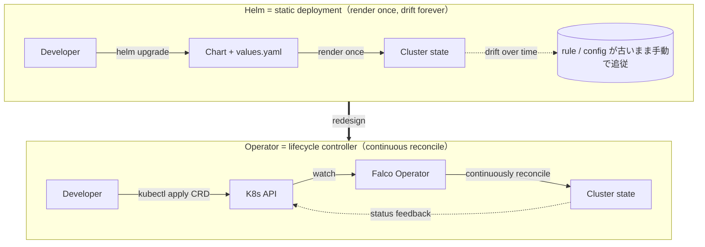
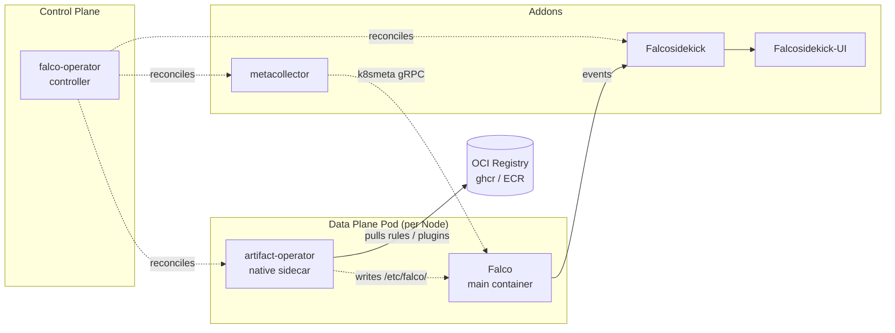
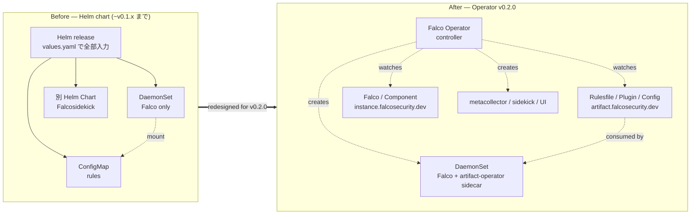
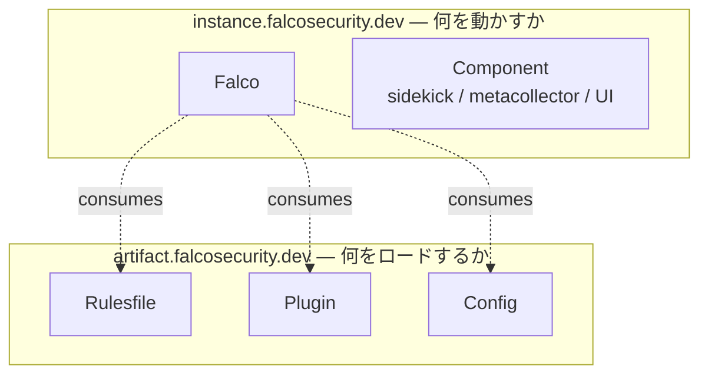
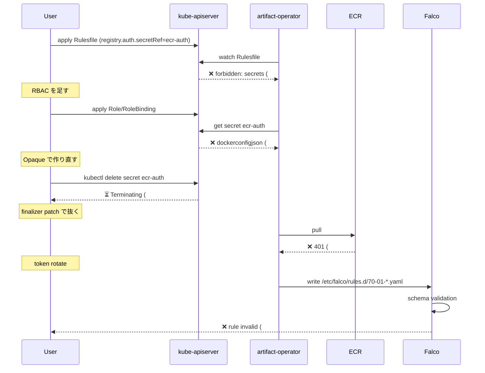
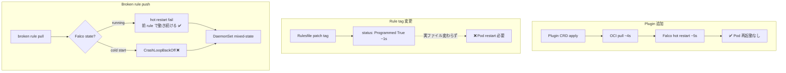
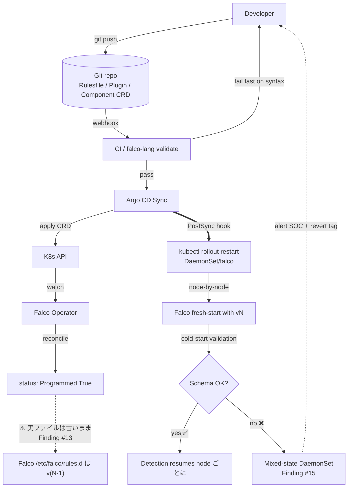

## この記事の結論

Falco Operator v0.2.0 は、**「Runtime Security as Code」を本気で目指した最初の production-ready architecture** だった。

✅ **完成度が高い領域**

- OCI artifact による rule / plugin 配布
- CRD ベースの declarative 管理
- **Plugin の hot reload**（5 秒・Pod 再起動なし）
- Operator upgrade と data plane の独立性
- 70+ output integrations 経由の alert routing

❌ **未完成な運用ギャップ**

- **Rule hot reload は破綻している**（Finding #13 — 本記事の主役）
- Broken rule rollback が弱く、DaemonSet が **mixed-state** になる
- GitOps 運用には **Pod rollout を必ずセット**で仕掛ける設計が必須

つまり v0.2.0 は **「半分完成した Runtime Security as Code」** というのが本記事の結論です。

## この記事の対象読者

- Kubernetes 上で **Falco を本番運用したい**人
- Falco Operator を **Helm の次世代として検証**している人
- **Runtime Security を GitOps 化**したい人
- Falco の **rule / plugin lifecycle** を仕組みから理解したい人

## 構成

3 章構成。各章は問いから始まります。

1. **なぜ Helm では限界があったのか — Falco Operator とは何者か**
2. **v0.2.0 で何が変わったのか — Before → After で見る設計刷新**
3. **本番運用で何にハマるのか — 10 シナリオ・17 findings の徹底検証**

---

2026 年は Falco が OSS として公開されてから **10 周年**（2016 → 2018 CNCF Sandbox → 2020 Incubating → 2024 Graduated）。その節目の KubeCon EU 2026 (2026-03-24) で maintainers の Aldo Lacuku (Kong) と Iacopo Rozzo (Sysdig) が発表した **"In Falco's Nest: The Evolution of Cloud Native Runtime Security"** で「最初の production-ready 版」として紹介されたのが **Falco Operator v0.2.0**（2026-03-23 release）です。本記事はその公式コンテクストと、実際に EKS で 10 シナリオ・3 日間ほど触り倒した検証結果を突き合わせた、運用観点のレビューです。検証コード・マニフェストは [higakikeita/falco-operator-v020-validation](https://github.com/higakikeita/falco-operator-v020-validation) に公開。

> 検証環境：EKS 1.31.14 (ap-northeast-1, t3.large × 2) / Falco 0.43.0 / Falco Operator 0.2.0 / modern eBPF probe

---

# 1. なぜ Helm では限界があったのか — Falco Operator とは何者か

## 1.1 まず Falco は何をやっているか

Falco は **「インフラのセキュリティカメラ」** と表現される runtime threat detection エンジン。kernel space で syscall や eBPF イベントを取り、user space の rule engine で「これは怪しい」を判定する。

検知ソース：

- syscall
- eBPF
- Kubernetes Audit Log
- container runtime events

ルールは `condition: ... and proc.name = "nc" and (proc.cmdline contains "-e ")` のような form で書く。**「コンテナの中で何が動いたか」をリアルタイムに可視化する**のが本職。CNCF Graduated（2024）の OSS。

## 1.2 Helm 時代の摩擦 — なぜ Operator が必要だったか

Falco を Helm chart で Kubernetes に入れる運用は長く行われてきたが、本番ではこういう摩擦が出る：

| 領域 | Helm 時代の現実 |
|---|---|
| Rules | YAML を ConfigMap に置く運用、誰が更新するかでもめる |
| Plugins | `.so` バイナリ配布が独自運用、バージョン揃えが手作業 |
| Config fragment | output 設定の追記がコピペ |
| Falcosidekick | alert 転送が別 chart で別 lifecycle |
| Multi-tenant | namespace ごとに違う rule を入れたいが Helm では難しい |
| Hot reload | Pod 再起動を伴う、検知 downtime が読めない |

これを構造的に整理すると：



Helm は「一度 render したら終わり」のテンプレートエンジン。**Falco Operator は「CRD が変わる → reconcile し続ける」lifecycle controller**。これら全部を CRD と Operator パターンで吸収するために v0.2.0 が登場した。

Operator は 5 つの CRD をウォッチして reconcile する：

- **Falco** — Falco 本体 instance（DaemonSet / Deployment）
- **Rulesfile** — 検知 rule の出所（OCI artifact or ConfigMap）
- **Plugin** — Falco plugin（.so ファイル）の出所
- **Config** — Falco config fragment
- **Component** — Falcosidekick / metacollector / UI などのエコシステムコンポーネント

これらを apply するだけで、Falco DaemonSet / artifact-operator sidecar / metacollector / Falcosidekick / UI + Redis が全部立ち上がる。**「Runtime Security as Code」の前提が CRD レベルで作り込まれている**。

## 1.3 全体アーキ — Operator + artifact-operator + metacollector



注目すべき 3 点：

1. **artifact-operator が各 Falco Pod の native sidecar として動く**。OCI registry から rule/plugin を pull して `/etc/falco/` 配下に書き込む役割。
2. **metacollector** は単独 Deployment として動き、Kubernetes API をウォッチして pod/namespace/labels を集約、各 Falco の `k8smeta` plugin に gRPC で配信。
3. Operator 本体は **どの Pod も作らない**。CRD を見て artifact-operator や Component に reconcile を委譲する薄いコントローラー。


> ### この章のポイント
> - Falco は **kernel-level 検知エンジン**、Helm では rule/plugin/sidekick の lifecycle が分散
> - **Helm = static template**、**Operator = continuous reconcile controller**
> - v0.2.0 は **5 つの CRD** でこれらを集約する control plane

---

# 2. v0.2.0 で何が変わったのか — Before → After

ここから 8 個の design 変更を Before → After で見ていく。すべて KubeCon EU 2026 maintainers talk で公式に提示された変更点。

## 2.1 全体像 — Helm 配布から Operator パターンへ



「YAML 1 ファイルを Helm にぶち込む」から「**5 種類の CRD を宣言的に管理する**」への転換。

## 2.2 CRD の刷新 — 2 つの API グループ



API グループが意図的に分離されている：

- **instance.falcosecurity.dev** — Falco / Component（「**何を動かすか**」）
- **artifact.falcosecurity.dev** — Rulesfile / Plugin / Config（「**何をロードするか**」）

これが効くのは「rule を image と同じパイプラインで運べる」こと。`ghcr.io/your-org/falco-rules:v1.2.3` を push して Rulesfile CRD で参照すれば、それだけで全 Pod に配布される。

## 2.3 Structured API types — 文字列 blob → 構造化 YAML

```yaml
# Before (v0.1.x)
apiVersion: artifact.falcosecurity.dev/v1alpha1
kind: Config
metadata:
  name: my-config
spec:
  config: |-                  # ← 文字列 blob
    engine:
      kind: modern_ebpf
    output_timeout: 2000
```

```yaml
# After (v0.2.0)
apiVersion: artifact.falcosecurity.dev/v1alpha1
kind: Config
metadata:
  name: my-config
spec:
  config:                     # ← structured YAML
    engine:
      kind: modern_ebpf
    output_timeout: 2000
```

たった 1 文字（`|-` の有無）の違いだが、これにより：

- **CRD schema validation** が値レベルで効く
- **VSCode などのエディタ補完** が効く
- **GitOps の PR レビュー** で diff が意味を持つ

「YAML in YAML escaping」から解放される。代償として CRD 自体が肥大化し、Finding #1（`kubectl apply` の 262KB 制限）の遠因になっている。

## 2.4 Redesigned OCI Artifact API

```yaml
# Before (v0.1.x)
spec:
  ociArtifact:
    reference: ghcr.io/falcosecurity/rules/falco-rules:latest
    pullSecret:
      secretName: my-secret
```

```yaml
# After (v0.2.0)
spec:
  ociArtifact:
    image:
      repository: falcosecurity/rules/falco-rules
      tag: latest
    registry:
      name: ghcr.io
      auth:
        secretRef:
          name: my-secret
```

`reference` 1 文字列で全部入りだったものを、**registry / repo / tag / auth に分解**。registry の TLS 設定や認証 secret 参照が綺麗に書ける。一方で **tag だけ変えても再 pull されない**問題（Finding #13）はこの構造を反映している（詳細は第 3 章）。

## 2.5 ConfigMap Support（v0.2.0 新規）

OCI artifact だけでなく **ConfigMap から rule / config を読む選択肢が追加された**：

```yaml
apiVersion: artifact.falcosecurity.dev/v1alpha1
kind: Rulesfile
metadata:
  name: custom-rules
spec:
  configMapRef:
    name: my-rules-configmap
  priority: 50
```

OCI が「image と同じパイプライン」なのに対し、ConfigMap は「**Kubernetes と同じパイプライン**」。version 管理は GitOps 側で持つ前提。社内検証や PoC レベルなら ConfigMap の方が摩擦が少ない。

## 2.6 native sidecar container（K8s 1.29+）

artifact-operator は `initContainer` + `restartPolicy: Always` で宣言される。**K8s 1.29 で beta 入りした native sidecar container** の構文。

```yaml
initContainers:
- name: artifact-operator
  image: docker.io/falcosecurity/artifact-operator:0.2.0
  restartPolicy: Always
```

これにより「Pod の lifecycle と一蓮托生だが、Falco container より先に Ready になる」という挙動が標準化され、**Falco は起動時点で必ず rules が `/etc/falco/rules.d/` に置かれている**状態を保証できる。

KubeCon arch スライドには **「SSA (Server-Side Apply) for conflict-free reconciliation」が公式要件**として明記されている。`kubectl apply -f install.yaml` で死ぬ（Finding #1）のは実装ミスではなく **SSA 前提の reconcile を前提とした仕様**。

## 2.7 metacollector で K8s metadata 経路を独立

```
Kubernetes API ─(watch)─→ metacollector ─(gRPC)─→ k8smeta plugin → Falco
```

これにより Falco の event payload は **2 経路の K8s metadata** を持つ：

- `k8s.ns.name` / `k8s.pod.name` — Falco の container introspection（標準）
- `k8smeta.ns.name` / `k8smeta.pod.name` — metacollector 経由（v0.2.0 新規）

新規 Pod に対する race condition で片方が欠落しても、もう片方が拾える冗長性。

## 2.8 Falco engine 自体の進化（0.42 / 0.43）

Operator の話ではないが、Falco 本体も並行して大きく進化した：

| 機能 | バージョン | 効果 |
|---|---|---|
| **Drop enter initiative** | 0.42 | カーネル instrumentation を軽量化 — **latency -20%、CPU -30%**。enter event を取らなくなり **`evt.dir` が deprecated**（[libs#2588](https://github.com/falcosecurity/libs/issues/2588)） |
| **Capture recording / Stratoshark** | 0.42 | Rule に `capture: true` と `capture_duration: 5000` を書けて、検知時のシステム挙動を [Stratoshark](https://stratoshark.org/) でフォレンジック解析 |
| Plugin event schema versioning | 0.42 | Plugin の互換性管理 |
| Thread table auto-purging | 0.42 | メモリ圧迫の自動緩和 |
| Container plugin perf/stability | 0.43 | エコシステム重要 plugin の安定化 |
| gRPC output / gVisor engine deprecated | 0.43 | サポート集約 |

特に **Drop enter initiative** は本記事の自作 rule 検証中にも警告として登場する（Finding #11）。

## 2.9 Helm との対比

| 項目 | Helm 時代 | v0.2.0 Operator |
|---|---|---|
| Deploy | ✅ | ✅ |
| Rule 更新 | ConfigMap 編集 → 手作業 | CRD + OCI artifact（or ConfigMap） |
| GitOps 親和性 | 普通 | 強い（5 CRD 個別管理） |
| Plugin 管理 | 弱い | Plugin CRD で OCI 配布 |
| Multi-tenant | 難 | namespace × Rulesfile で容易 |
| Declarative 度 | 部分的 | 完全 |
| Hot reload | Pod restart 必須 | **Plugin は OK / Rule は半分動かない**（第 3 章） |

要するに **「rule を image と同じ思想で運ぶ」が CRD レベルで完全に実装された**のが v0.2.0。ただし運用 lifecycle にはまだ穴がある。次章で全部見ていく。

> ### この章のポイント
> - CRD が **`instance.*`（何を動かすか）と `artifact.*`（何をロードするか）の 2 グループ**に分離
> - API は **string blob から structured YAML** へ進化（schema validation が効く代償で CRD 自体は肥大化）
> - **ConfigMap も rule の出所**として選べる柔軟性
> - **SSA は公式要件** — `kubectl apply` で死ぬのは仕様

---

# 3. 本番運用で何にハマるのか — 10 シナリオ・17 findings の徹底検証

## 3.0 検証アプローチと findings の重要度分類

EKS 1.31 上で Falco Operator v0.2.0 + Falco 0.43.0 + 全エコシステムコンポーネントを Quickstart 配置し、以下 10 シナリオを実施：

1. 基本導入確認
2. Runtime Detection
3. OCI Artifact rule distribution
4. Rule Hot Reload
5. Broken Rule Rollback
6. Metadata Enrichment under scale
7. False Positive Operational Load
8. Falcosidekick Webhook Routing
9. Plugin Lifecycle
10. Operator Upgrade

検証中に **17 個の非自明な findings** が見つかった。重要度で分類すると：

### 🔴 Critical — 検知能力に直接影響
| # | finding |
|---|---|
| **#13** | **Rule hot reload が破綻**（tag 変更で再 pull されない、status は Programmed: True 詐欺） |
| **#14** | Hot restart 中の broken rule → graceful fallback あり |
| **#15** | Cold start 中の broken rule → CrashLoop。**DaemonSet が mixed-state になる** |

### 🟠 Operational — 運用設計で避けられない
| # | finding |
|---|---|
| #1 | install.yaml が `kubectl apply` で死ぬ → `--server-side` 必須 |
| #2 | EKS 1.31 で in-tree EBS provisioner 削除 → `aws-ebs-csi-driver` addon 必要 |
| #7 | `falco` SA に secrets RBAC なし → 自前で Role+RoleBinding |
| #10 | ECR token は 12h で expire → Secret rotation 必須 |
| #17 | enterprise Slack は admin 承認壁 → 通知パイプラインのオーナー決め |

### 🟢 Design — 設計仕様（理解すれば腑に落ちる）
| # | finding |
|---|---|
| #3 | artifact-operator は native sidecar (initContainer + restartPolicy: Always) |
| #4 | CRD が `instance.*` / `artifact.*` の 2 グループに分離 |
| #5 | k8smeta plugin の metacollector 接続は exponential backoff（~30 秒） |
| #6 | enrichment が 2 経路（`k8s.*` 標準 + `k8smeta.*` metacollector） |
| #9 | `secret-in-use` finalizer で Secret delete が hang（**仕様**） |
| #16 | Plugin の hot reload は動く（Rule との非対称） |

### 🔵 UX — 開発者体験のひっかかり
| # | finding |
|---|---|
| #8 | Secret は **Opaque + username/password**、dockerconfigjson は NG |
| #11 | default rule に `spawned_process` / `container` macro なし → inline 化必要 |
| #12 | `oras push` の tar.gz は parse 不可 → **`falcoctl push` 必須** |

以下、シナリオごとに見ていく。

## 3.1 導入 (Scenario 1-2)

### Finding #1: `install.yaml` が `kubectl apply` で死ぬ 🟠

```
The CustomResourceDefinition "components.instance.falcosecurity.dev" is invalid:
metadata.annotations: Too long: must have at most 262144 bytes
```

`kubectl apply` は `last-applied-configuration` annotation に YAML 全文を書き込むため 262 KB 制限に引っかかる。**回避**：`--server-side` を使う（§2.6 で説明した SSA 公式要件）。

### Finding #2: EKS 1.31 で Redis が永遠に Pending 🟠

Quickstart の Redis StatefulSet が PVC unbound のまま。EKS 1.31 は in-tree EBS provisioner が削除済み。**回避**：`aws-ebs-csi-driver` addon + `gp3` StorageClass を default に。

### Finding #3: native sidecar が動いている 🟢

```bash
$ kubectl get pod -n falco -l app.kubernetes.io/instance=falco \
    -o jsonpath='{.items[0].spec.initContainers[0]}'
# {"name":"artifact-operator","restartPolicy":"Always",...}
```


### Finding #4: CRD 2 グループ分離 🟢

§2.2 で解説済。実物が `kubectl get crd | grep falco` で見える。

### Finding #5: k8smeta plugin の retry backoff 🟢

Falco 起動直後は metacollector への gRPC 接続が exponential backoff で再試行され、**~30 秒で確立**する。それまで `k8smeta.*` 系の field は空になる。

### Finding #6: enrichment 2 経路（実物） 🟢

```bash
$ kubectl exec -n test nginx -- cat /etc/shadow
# fires "Read sensitive file untrusted" (Warning)
```

Alert payload にこういう field が並ぶ：

```json
{
  "k8s.ns.name": "test",
  "k8s.pod.name": "nginx",
  "k8smeta.ns.name": "test",
  "k8smeta.pod.name": "nginx"
}
```


## 3.2 OCI 配布 (Scenario 3) — 7 連発のハマり

自作 rule を ECR に置いて Rulesfile CRD で参照するだけ、のはずが **7 個ハマった**。



| # | 重要度 | 何が起きるか | 対応 |
|---|---|---|---|
| #7 | 🟠 | `falco` SA に secrets RBAC なし | Role + RoleBinding 追加 |
| #8 | 🔵 | Secret は **Opaque + username/password**、dockerconfigjson は NG | `kubectl create secret generic` |
| #9 | 🟢 | artifact-operator が `secret-in-use` finalizer を貼る → delete が hang。**KubeCon arch 図に "Protected by finalizers" と明記**されており仕様 | finalizer patch で抜く |
| #10 | 🟠 | ECR token は **12h で expire** | CronJob で rotate、IRSA + ECR helper |
| #11 | 🔵 | `spawned_process` / `container` macro が default OCI rule に **含まれていない**。`evt.dir = <` も Drop enter initiative で deprecated | inline で `evt.type=execve and container.id != host` |
| #12 | 🔵 | `oras push` の tar.gz は Falco が parse 不可 | **`falcoctl push` 必須**（追加メタレイヤーを生成） |

最終的に Rulesfile が `Programmed: True` になる：


## 3.3 v0.2.0 最大のギャップ — Rule hot reload は未完成（Finding #13 🔴）

ここからが**本記事の主役**。Plugin の hot reload は綺麗に動く（3.8 で後述）。**しかし Rule の hot reload は壊れている**。

```bash
$ kubectl patch rulesfile -n falco custom-rules \
    --type=merge -p '{"spec":{"ociArtifact":{"image":{"tag":"custom-v5"}}}}'
```

1 秒後に status は `Programmed: True`。message も `All artifacts sources were programmed successfully`。

**ところが実ファイルは変わっていない**：

```bash
$ kubectl exec falco-xxx -c falco -- grep '^- rule:' \
    /etc/falco/rules.d/70-01-custom-rules-oci.yaml
- rule: Reverse shell via netcat -e       # ← v3 (古い)
- rule: Curl pipeline to shell             # ← v3 (古い)
# v5 で追加したはずの 'Hot reload sentinel' が居ない
```

artifact-operator のログを見ても、tag を変えただけでは再 pull していない。annotation で reconcile を強制しても同じ。**唯一動く方法は Pod を delete して再起動**。だが DaemonSet 全 Pod を一斉に消すと **45 秒ほど検知が空白**になる。

**なぜこれが本記事の主役か**：

- **CRD は正しく Programmed: True と報告する** → 監視からは正常に見える
- **でも実環境は古い rule のまま動いている** → 検知能力は更新されていない
- これは GitOps で気付けない **silent drift**。Argo CD / Flux で「Synced」と出ても rule は古い

つまり v0.2.0 で「rule を image のように扱える」と書かれていても、**tag を変えるだけでは反映されない**。本気で GitOps 運用するなら、3.11 で示す Pod rollout を必ずセットで仕掛ける設計が必須。

## 3.4 Broken Rule Rollback (Scenario 5) — Finding #14, #15 🔴

意図的に invalid syntax の rule を push して両 Pod を delete して再起動してみる。



結果は**ノード間で非対称**：

- **Pod A (`2/2 Running`)** — 既に v5 で起動済み → 内部 hot restart で broken rule をリジェクト → 前 rule で動き続ける（**graceful fallback**）
- **Pod B (`CrashLoopBackOff`)** — fresh start で broken rule を読む → schema validation で die → fallback なし


つまり broken rule の rollout は **DaemonSet を mixed-state にする**。

**mixed-state が何故怖いか**：

> 同じ cluster の中で、**node によって検知能力が違う**状態が発生する。具体的には、同じ攻撃でも node A では検知され node B では素通りする。SOC アラートが特定ノードからだけ来ない（または来すぎる）非対称が起きる。攻撃者が node を選んで動けば、検知パターンを大きく揺らがせることができる。

これは Kubernetes / SRE 文脈で「partial rollout failure」と同種だが、Runtime Security の場合は **「気付けない rollback」** という性質を持つ。alert が来ないこと自体が異常を示さないからだ。

## 3.5 Metadata Enrichment under Scale (Scenario 6)

`kubectl scale deploy/nginx-scaled --replicas=30` 直後（pod Ready から 3 秒後）に exec しても、`k8s.*` と `k8smeta.*` 両方とも埋まる。metacollector の応答は十分速い。

## 3.6 False Positive (Scenario 7)

`apt-get update` × 10 で **発火ゼロ**。default 25 rule は surgical で、運用コマンドには光らない。これは Helm 時代の「rule set 全部入りで FP 大量」イメージとの差別化として書ける fact。

## 3.7 Falcosidekick Webhook Routing (Scenario 8) — Finding #17 🟠

Falcosidekick の売りは **70+ integrations**（Slack / Teams / S3 / Kafka / Elasticsearch / Loki / PagerDuty / ...）。`WEBHOOK_ADDRESS` を Component CRD で注入すれば webhook.site への forward は即動く：

```yaml
apiVersion: instance.falcosecurity.dev/v1alpha1
kind: Component
metadata:
  name: falcosidekick
  namespace: falco
spec:
  component:
    type: falcosidekick
  replicas: 2
  podTemplateSpec:
    spec:
      containers:
      - name: falcosidekick
        env:
        - name: WEBHOOK_ADDRESS
          value: https://webhook.site/your-endpoint
        - name: WEBHOOK_MINIMUMPRIORITY
          value: notice
```

ただし **enterprise Slack の `Incoming Webhooks` install は admin 承認が必須**（Sysdig workspace でも実際にブロックされた）。これは Operator のせいではないが、本番運用で「Runtime Security の通知だけ宙ぶらりん」を防ぐには **通知パイプラインのオーナーを最初に決めておく** 必要がある。

## 3.8 Plugin Lifecycle (Scenario 9) — Finding #16 🟢

`json` plugin を Plugin CRD で追加：

```bash
$ date -u +%FT%TZ; kubectl apply -f manifests/plugin-json.yaml
2026-05-22T10:18:21Z
plugin.artifact.falcosecurity.dev/json serverside-applied
```

- **T+4s**: Plugin CRD が `Programmed: True`
- **T+5s**: Falco が hot restart して `Loaded plugin 'json@0.7.4'`
- **Pod 再起動なし**（RESTARTS counter 不変）
- 検知 downtime 視認不可

Rule の hot reload は壊れているのに、Plugin は綺麗に動く。**非対称**。

## 3.9 Operator Upgrade (Scenario 10)

`kubectl rollout restart deploy/falco-operator`：

- **11 秒で controller 切替**
- 既存 Falco DaemonSet / Rulesfile / Plugin / Component は完全に維持
- 再起動後の detection 発火も即時 OK

**control plane upgrade と data plane が独立**。本番で Operator を上げる際の不安は薄い。

## 3.10 What's Next — Falco 0.44 以降の roadmap

検証で見えた現実は上記の通りだが、KubeCon EU 2026 で発表された roadmap を見ると将来は明るい。

| 機能 | ステータス | 何が解決するか |
|---|---|---|
| **BPF Iterators**（0.44） | 開発中 | procfs スキャンより高速な thread 情報取得・state recovery（[libs#2879](https://github.com/falcosecurity/libs/issues/2879)） |
| **Multi-thread support** | Soon in Tech Preview | high-core machine（数百コア時代）での saturate 対策。per-CPU ring buffer → worker thread fan-out（[falco#3749](https://github.com/falcosecurity/falco/issues/3749)） |
| **Falco LSP** | Soon on VSCode Marketplace | **Finding #11 の決定打**。VS Code 上で syntax 診断 / completion / hover doc / CI validation（[falco-lsp](https://github.com/falcosecurity/falco-lsp)） |
| **Coding Agents Kit** | Tech Preview | AI agent が Falco rule を書く（[leogr/coding-agents-kit](https://github.com/leogr/coding-agents-kit)） |

特に **Falco LSP は Runtime Security as Code の本気度を上げる**。`falco-lang validate` を CI に組み込めば、今回ハマった macro 未定義や `evt.dir` deprecated は防げる。

Falco 10 周年を記念して **Sysdig が $70,000 を CNCF に寄付**（feature development grant / contributor stipend / technical writer stipend）。OSS としての継続投資コミットメントも合わせて見ておきたい。

## 3.11 推奨 GitOps 運用構成

Finding #13 と mixed-state リスクを踏まえた、**本番で v0.2.0 を使う場合の推奨フロー**：



**設計上のポイント**：

1. **CI で `falco-lang validate`**（Falco LSP の CLI 版）を必ず通す → Finding #11/#15 を未然防止
2. Argo CD は **Sync 時に PostSync hook で Pod rollout** を強制 → Finding #13（silent drift）を防ぐ
3. Rollout は **OnDelete strategy で node-by-node** にする → 全 Pod 同時 down で検知 downtime を作らない
4. **PreSync で broken rule の早期検知**を仕込む → mixed-state を構造的に防ぐ
5. Pod が CrashLoop に入ったら **即 alert → 自動 revert** までを Pipeline 化

> ### この章のポイント
> - 🔴 **Finding #13 が本番運用の最重要ギャップ** — tag 変更だけでは再 pull されない silent drift
> - 🔴 **mixed-state DaemonSet** は「気付けない rollback」を生む（node ごとに検知能力が違う）
> - **Plugin hot reload は綺麗に動く**ので、Rule との非対称が悩ましい
> - **GitOps なら Rollout を PostSync hook で必ずセット**、CI で `falco-lang validate` を回す

---

## 3.12 結論 — v0.2.0 は **半分** Runtime Security as Code

✅ **v0.2.0 が提供するもの**

- CRD ベースの宣言的管理（GitOps 親和性）
- OCI artifact による rule / plugin 配布（image と同じ思想）
- ConfigMap でも rule を運べる柔軟性
- Plugin の hot reload（pod 再起動なし）
- Falco engine 側の graceful fallback
- Operator upgrade と data plane の独立性
- 70+ output integrations 経由の alert routing

❌ **v0.2.0 がまだ提供しないもの**

- **Rule の tag 変更だけでの hot reload**（要 Pod restart）
- **Broken rule からの自動 rollback**（mixed-state を防ぐには PreSync 検証が必要）
- **ECR token の自動 rotation**
- **install 時の RBAC 完備**（private OCI registry なら追加 manifest 必須）
- **Slack 連携の self-service**（enterprise では admin block）

Pod restart を許容できる運用なら **Helm より圧倒的に綺麗**。CRD 1 つで rule 配布、Plugin 1 つで OCI artifact の version 管理。これは Helm では届かなかった世界。

---

## 補遺

検証クラスタは EKS 1.31 / ap-northeast-1 / t3.large × 2 / 3 日稼働で約 $10。すべて [higakikeita/falco-operator-v020-validation](https://github.com/higakikeita/falco-operator-v020-validation) で再現可能です。

公式コンテクスト：

- **KubeCon EU 2026 maintainers talk** — "In Falco's Nest: The Evolution of Cloud Native Runtime Security" by Aldo Lacuku (Kong) + Iacopo Rozzo (Sysdig), 2026-03-24
- [Falco Operator v0.2.0 release notes](https://github.com/falcosecurity/falco-operator/releases/tag/v0.2.0)
- [falcosecurity/falco-operator](https://github.com/falcosecurity/falco-operator)
- [falcosecurity/falco-lsp](https://github.com/falcosecurity/falco-lsp)

筆者は Sysdig 社員ですが、本記事は OSS Falco Operator v0.2.0 への純粋な機能評価です。v0.3 で Finding #13 が解消され、Falco LSP が GA すれば、**Runtime Security as Code は本当に "as Code" になる**と思っています。Falco 10 周年の節目に v0.2.0 が来たのは象徴的で、次の 10 年は「rule を image と同じ思想で管理する」が当たり前になるはず。
